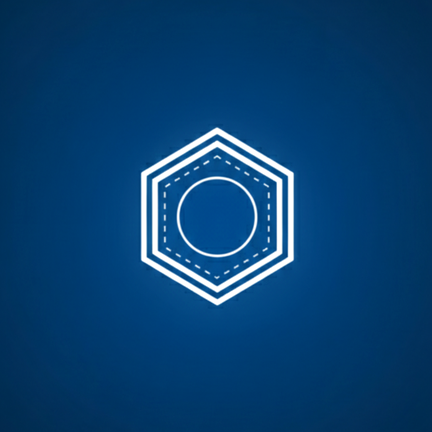

# PubChem Explorer

<div align="center">
  

  **Chemical Intelligence Platform**

  A modern Flutter application for exploring chemical compounds using the PubChem database.
</div>

---

## 📱 App Overview

**PubChem Explorer** is a mobile application that provides seamless access to the world's largest collection of freely accessible chemical information. Built with Flutter, the app enables users to search, explore, and learn about chemical compounds with an intuitive and visually appealing interface.

### Key Features

- **🔍 Smart Search**: Search compounds by name, formula, or CID with real-time suggestions
- **📊 Detailed Compound Information**: View comprehensive molecular properties, structures, and descriptions
- **⭐ Featured Compounds**: Explore curated lists of important chemical compounds
- **📜 Search History**: Quick access to recently searched compounds
- **🌓 Theme Support**: Toggle between light and dark modes
- **🌐 Localization**: Multi-language support (English/Bangla)
- **✨ Beautiful UI**: Animated splash screen with custom branding and smooth transitions

---

## 🏗️ Architecture

This project follows **Clean Architecture** principles combined with **feature-based modularization** to ensure scalability, maintainability, and testability.

### Architecture Layers

```
┌─────────────────────────────────────┐
│      Presentation Layer             │
│  (UI, Controllers, State Models)    │
│      ↓ Uses Use Cases               │
├─────────────────────────────────────┤
│       Domain Layer                  │
│  (Use Cases, Entities, Repos)       │
│      ↓ Defines Contracts            │
├─────────────────────────────────────┤
│        Data Layer                   │
│  (Repositories, Data Sources, APIs) │
│      ↓ Implements Contracts         │
├─────────────────────────────────────┤
│     Infrastructure Layer            │
│  (Network, Storage, Platform APIs)  │
└─────────────────────────────────────┘
```

### Key Architectural Patterns

#### 1. **Clean Architecture**
- **Presentation Layer**: Contains UI components (screens, widgets) and state management (Riverpod controllers)
- **Domain Layer**: Business logic, use cases, and repository interfaces (pure Dart, no framework dependencies)
- **Data Layer**: Implementation of repositories, API clients, and data sources

#### 2. **State Management: Riverpod**
- Uses `flutter_riverpod` with code generation (`riverpod_generator`)
- Provides type-safe, testable, and maintainable state management
- Controllers handle business logic and state transformations

#### 3. **Dependency Injection**
- All dependencies are provided through Riverpod providers
- Defined in `lib/app/core/provider/providers.dart`
- Enables easy testing with mock implementations

#### 4. **Navigation: GoRouter**
- Declarative routing with type-safe navigation
- Support for nested navigation (ShellRoute for bottom navigation)
- Full-screen routes for details and search screens

#### 5. **Network Layer**
- **Retrofit** + **Dio** for REST API calls
- Custom interceptors for logging and error handling
- Exception handling with custom exception classes

#### 6. **Local Storage**
- **FlutterSecureStorage**: For key-value storage (theme, locale preferences)

---

## 📂 Project Structure

```
lib/
├── app/
│   ├── core/                          # Core utilities and shared components
│   │   ├── base/                      # Base classes (theme, common functions)
│   │   ├── provider/                  # Global Riverpod providers
│   │   ├── route/                     # App routing configuration
│   │   ├── values/                    # Constants (colors, fonts, text styles, API endpoints)
│   │   └── widget/                    # Reusable widgets
│   │
│   ├── data/                          # Data layer
│   │   ├── datasources/
│   │   │   ├── local/                # Local data sources (SQLite, SharedPreferences)
│   │   │   └── remote/               # Remote data sources (API clients)
│   │   │       └── pubchem/          # PubChem API implementation
│   │   └── repositories/             # Repository implementations
│   │
│   ├── domain/                        # Domain layer (Business Logic)
│   │   ├── models/                   # Domain entities
│   │   ├── repositories/             # Repository interfaces
│   │   └── usecases/                 # Business use cases
│   │       ├── compound_details/
│   │       ├── search/
│   │       ├── locale/
│   │       └── theme/
│   │
│   ├── network/                       # Network utilities
│   │   ├── exceptions/               # Custom exception classes
│   │   ├── dio_provider.dart         # Dio configuration
│   │   └── request_headers.dart      # HTTP headers
│   │
│   ├── presentation/                  # Presentation layer (UI)
│   │   ├── splash/                   # Splash screen with animations
│   │   ├── main/                     # Main screen with bottom navigation
│   │   ├── home/                     # Home screen with featured compounds
│   │   ├── search/                   # Search screen with history
│   │   ├── details/                  # Compound details screen
│   │   └── more/                     # Settings and more options
│   │       ├── controllers/          # Riverpod controllers
│   │       ├── models/               # UI state models
│   │       ├── views/                # Screen widgets
│   │       └── widgets/              # Feature-specific widgets
│   │
│   ├── utils/                         # Utility functions and extensions
│   └── my_app.dart                   # Root app widget
│
├── flavors/                           # Environment configuration
│   ├── build_config.dart
│   ├── env_config.dart
│   └── environment.dart
│
├── main_dev.dart                      # Development entry point
└── main_prod.dart                     # Production entry point
```

### Feature Organization

Each feature follows a consistent structure:

```
feature_name/
├── controllers/          # Riverpod state controllers
├── models/              # Feature-specific models/state classes
├── views/               # Screen widgets
└── widgets/             # Feature-specific reusable widgets
```

---

## 🛠️ Tech Stack

### Core
- **Flutter SDK** `>=3.1.0`
- **Dart** `>=3.1.0`

### State Management
- `flutter_riverpod` - Reactive state management
- `riverpod_annotation` + `riverpod_generator` - Code generation for providers

### Network & API
- `dio` - HTTP client for API calls
- `retrofit` + `retrofit_generator` - Type-safe REST client
- `pretty_dio_logger` - Network request/response logging

### Navigation & Routing
- `go_router` - Declarative routing and navigation

### Local Storage
- `sqflite` - SQLite database for persistent storage
- `flutter_secure_storage` - Encrypted storage for sensitive data

### UI & Design
- `flutter_screenutil` - Responsive UI sizing
- `cached_network_image` - Image caching and loading
- `flutter_svg` - SVG rendering
- `animations` - Pre-built material design animations

### Utilities
- `logger` - Logging utility
- `intl` - Internationalization and localization

### Development Tools
- `build_runner` - Code generation
- `flutter_lints` - Linting rules
- `mockito` - Unit testing with mocks

---

## 🚀 How to Run the Project

### Prerequisites

1. **Flutter SDK** (version 3.1.0 or higher)
   ```bash
   flutter --version
   ```

2. **IDE**: Android Studio, VS Code, or IntelliJ IDEA with Flutter plugins

3. **Device/Emulator**:
   - Android device/emulator (Android 5.0+)
   - iOS device/simulator (iOS 12.0+)

### Installation Steps

#### 1. Clone the Repository
```bash
git clone https://github.com/shakircam/PubChamApp.git
cd pub_chem_app
```

#### 2. Install Dependencies
```bash
flutter pub get
```

#### 3. Generate Code
Run code generation for Riverpod providers and Retrofit API clients:
```bash
flutter pub run build_runner build --delete-conflicting-outputs
```

#### 4. Run the App

**Development Mode:**
```bash
flutter run --flavor dev -t lib/main_dev.dart
```

**Production Mode:**
```bash
flutter run --flavor prod -t lib/main_prod.dart
```

### Generate App Icons
If you need to regenerate app icons:
```bash
flutter pub run flutter_launcher_icons:main
```

---

## 🎯 Build & Release

### Build APK (Android)
```bash
# Development
flutter build apk --flavor dev -t lib/main_dev.dart

# Production
flutter build apk --flavor prod -t lib/main_prod.dart --release
```

### Build App Bundle (Android)
```bash
flutter build appbundle --flavor prod -t lib/main_prod.dart --release
```

### Build IPA (iOS)
```bash
flutter build ipa --flavor prod -t lib/main_prod.dart --release
```

---

## 🔧 Configuration

### Environment Configuration

The app supports multiple environments (dev/prod) configured in the `flavors/` directory:

**Development** (`main_dev.dart`):
- Base URL: `https://pubchem.ncbi.nlm.nih.gov/rest/pug/`
- Crash logging enabled
- Debug logging enabled

**Production** (`main_prod.dart`):
- Base URL: `https://pubchem.ncbi.nlm.nih.gov/rest/pug/`
- Optimized for performance
- Minimal logging

### API Configuration

API endpoints are defined in `lib/app/core/values/api_end_points.dart`. The app uses the **PubChem REST API** for all compound data.

---

## 🧪 Testing

### Run Unit Tests
```bash
flutter test
```

### Run Tests with Coverage
```bash
flutter test --coverage
```

---

## 📱 Features Breakdown

### 1. Splash Screen
- Custom animated hexagon logo with elastic animation
- Gradient background matching app theme
- Loading progress indicator
- Seamless native-to-Flutter splash transition

### 2. Home Screen
- Featured compounds carousel
- Quick search access
- Latest chemical insights
- Filter chips for compound categories

### 3. Search Screen
- Real-time compound search
- Recent search history
- Search suggestions
- Clear history option

### 4. Details Screen
- Compound structure visualization
- Molecular properties
- Chemical formula and weight
- IUPAC name and synonyms
- Detailed descriptions

### 5. Settings (More)
- Theme toggle (Light/Dark)
- Language selection
- About app information

---

## 🤝 Contributing

Contributions are welcome! Please follow these steps:

1. Fork the repository
2. Create a feature branch (`git checkout -b feature/amazing-feature`)
3. Commit your changes (`git commit -m 'Add amazing feature'`)
4. Push to the branch (`git push origin feature/amazing-feature`)
5. Open a Pull Request

---

## 📄 License

This project is licensed under the MIT License - see the LICENSE file for details.

---

## 📞 Contact

**Developer**: MD Ibrahim Khalil Shakir

**Project Link**: [https://github.com/shakircam/pub_chem_app](https://github.com/yourusername/pub_chem_app)

---

## 🙏 Acknowledgments

- [PubChem](https://pubchem.ncbi.nlm.nih.gov/) for providing the free chemical database API
- Flutter community for amazing packages and support
- All contributors who help improve this project

---

<div align="center">
  Made with ❤️ using Flutter
</div>